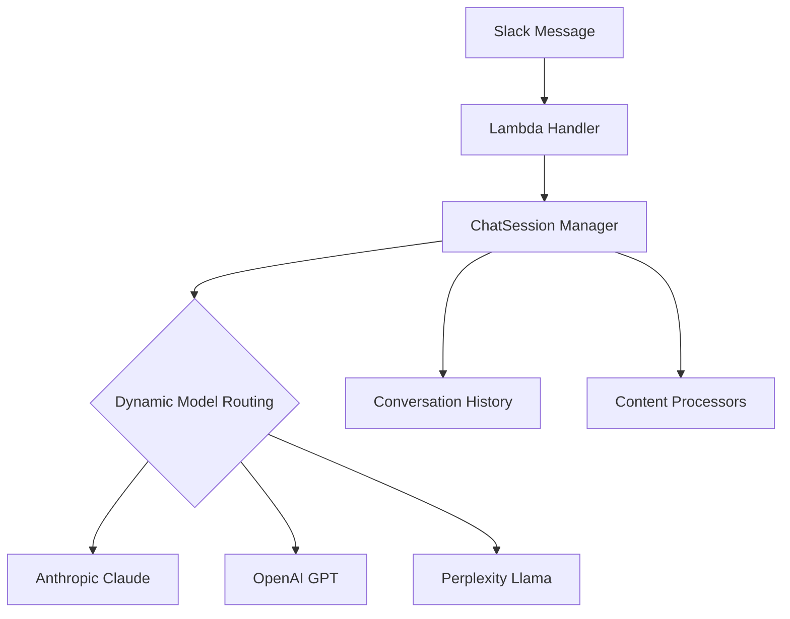

# SushiBot - Multi-LLM Slack Assistant 🍣

A serverless Slack bot supporting multiple LLM providers (Anthropic, OpenAI, Perplexity, etc) 
built for AWS Lambda deployment with proper error handling and conversation management.

## Key Features

- **💬 Thread-based Conversations** - Natural chat flow with session history  
- **🤖 Multi-Model Support** - Switch between LLM providers mid-conversation
- **🌐 Web Content Ingestion** - Process URLs, PDFs, YouTube videos & text files
- **⚡ Real-time Streaming** - Responsive message delivery with typing indicators
- **🧠 Reasoning Visibility** - Option to view model's chain-of-thought

## Command Reference

| Command         | Description                                  |
|-----------------|----------------------------------------------|
| `\\reset`       | Clear current conversation history           | 
| `\\who`         | Show active LLM provider                     |
| `\\model_name`  | Switch providers (e.g. `\\gpt4`, `\\sonnet`) |
| `\\stream`      | Toggle real-time response streaming          |
| `\\thoughts`    | Toggle display of LLM's reasoning process    |
| `\\help`        | Show full command list and documentation     |

## Architecture Overview



## Deployment Requirements

1. **AWS Lambda** Python 3.10+ Runtime
2. **Slack App Credentials**
   ```bash
   SLACK_BOT_TOKEN=xoxb-...
   SLACK_SIGNING_SECRET=123abc...
   ```
3. **DynamoDB Table** - Session storage `agent_slackbot_agno_sessions`
4. **S3 Bucket** - File cache (optional)
5. **Installed Dependencies**  
   ```bash
   pip install -r requirements.txt
   ```

[](https://aws.amazon.com/lambda/)
